# 🏭 종루이코리아 MES - 시스템

> 제조업 생산 현장의 설비 · 기준정보 · 생산계획 · 생산실적 전 과정을 관리하는 **MES(Manufacturing Execution System)** 중 생산관리(PL, Production Line) 영역을 설계 및 개발한 프로젝트입니다.

---

## 📋 목차
1. [프로젝트 개요](#-프로젝트-개요)
2. [기술 스택](#-기술-스택)
3. [시스템 아키텍처](#-시스템-아키텍처)
4. [주요 기능](#-주요-기능)
   - [1. 생산 설비 관리](#1-생산-설비-관리)
   - [2. 기준정보(Master Data) 관리](#2-기준정보master-data-관리)
   - [3. 다국어(i18n) 관리](#3-다국어i18n-관리)
   - [4. 생산관리](#4-생산관리)
5. [핵심 도메인 ERD](#-핵심-도메인-erd)
6. [핵심 기술 포인트](#-핵심-기술-포인트)
7. [화면 구성](#-화면-구성)

---

## 📌 프로젝트 개요

| 항목 | 내용 |
|---|---|
| 프로젝트명 | 종루이코리아 MES -생산관리 시스템 |
| 담당 역할 | PL, 풀스택 개발 (요구사항 분석, 화면/DB 설계, 백엔드·프론트엔드 개발) |
| 개발 기간 | 2024.11~ 2025.07 |
| 사용 기술 | Java, Spring Boot, Vue.js, MySQL |

제조업 특성상 다품종 생산 구조(원소재 → 반제품 → 완제품)를 가진 고객사를 대상으로, **설비-공정-제품**의 매핑 구조를 설계하고 이를 기반으로 생산계획부터 생산실적, 작업일보까지 이어지는 생산관리 전 프로세스를 구축했습니다. 또한 해외 사업장 확장을 고려한 **다국어 지원 구조**를 직접 설계 및 개발했습니다.

---

## 🛠 기술 스택

**Backend**
- Java, Spring Boot
- MyBatis
- MySQL

**Frontend**
- Vue.js

**기타**
- 태블릿 / 키오스크 환경 대응 화면 (생산실적 입력)
- 다국어(i18n) 처리 모듈

---

## 🏗 시스템 아키텍처

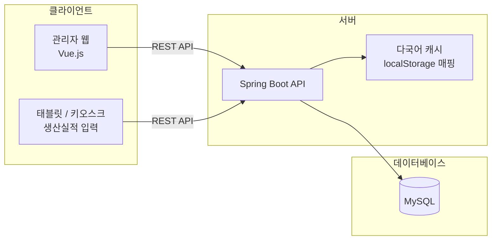

---

## 🎯 주요 기능

### 1. 생산 설비 관리

**1-1. 설비-공정 매핑 구조 설계**
- 생산 설비를 등록하고, 각 설비 하위에 여러 공정을 매핑할 수 있는 구조로 설계
- 설비 단위로 공정 흐름을 트리 형태로 관리하여, 이후 BOM 및 생산계획에서 설비-공정 정보를 일관되게 참조

**1-2. 설비 수리내역 등록 및 이력 관리**
- 설비별 고장/수리 내역을 등록하고 시계열 이력으로 조회할 수 있도록 설계
- 수리 담당자, 수리 일시, 수리 내용 등을 기록하여 설비 유지보수 데이터 축적

**1-3. 설비 가동 중단내역 등록 및 이력 관리**
- 설비 가동 중단 발생 시점/원인/복구 시점을 기록
- 설비별 가동률 산출 및 생산 일정 조정의 기초 데이터로 활용

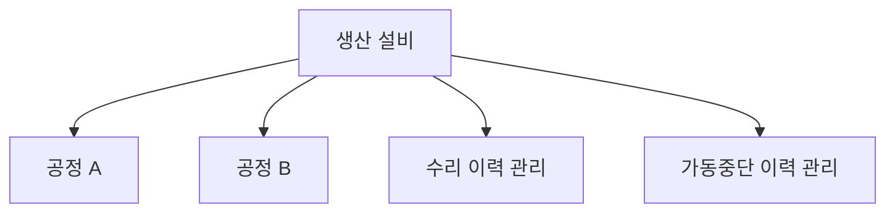

---

### 2. 기준정보(Master Data) 관리

**2-1. 거래처 정보 관리**
- 매출처/매입처를 구분하여 거래처 기준정보 설계
- 거래처별 거래 유형, 담당자, 계약 정보 등 관리

**2-2. BOM(Bill of Material) 정보 관리**
- 원소재 → 반제품 → 완제품으로 이어지는 자재 구성 체계를 BOM으로 설계
- 자재별 투입 비율, 단위 등을 관리하여 생산계획 산출의 기초 데이터로 활용

**2-3. 완제품 설계**
- 완제품과 이를 생산하기 위한 반제품, 공정/설비 정보를 매핑
- 완제품 단위의 생산 흐름(어떤 반제품을 어떤 공정/설비에서 가공하여 완제품이 되는지)을 정의

**2-4. 반제품 설계**
- 반제품과 이를 생산하기 위한 원소재, 공정/설비 정보를 매핑
- 반제품 단위의 생산 흐름을 정의하여 완제품 BOM과 연계

**2-5. 원소재 설계**
- 원소재 기준정보(코드, 규격, 단위, 거래처 등) 관리

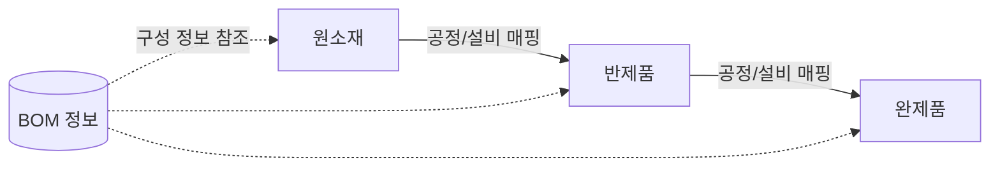

---

### 3. 다국어(i18n) 관리

**3-1. 다국어 관리 화면 개발**
- 메뉴/페이지 라벨에 대한 다국어 텍스트를 등록·수정할 수 있는 관리자 화면 개발
- 언어 코드별로 동일 키에 대한 번역값을 관리

**3-2. 서버 실행 시 localStorage 캐싱을 통한 자동 매핑**
- 서버 기동 시 다국어 데이터를 클라이언트의 `localStorage`에 세팅
- 화면 이동(라우팅) 시 별도 API 호출 없이 캐시된 데이터를 기반으로 메뉴 및 페이지 텍스트를 해당 언어로 자동 매핑
- 불필요한 API 호출을 줄여 다국어 전환 시의 화면 반응 속도 개선

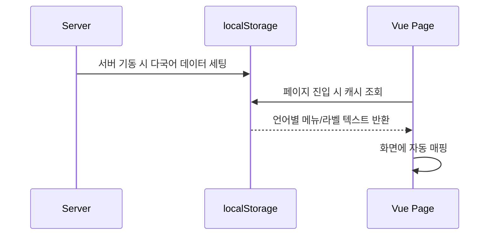

---

### 4. 생산관리

**4-1. 생산요청 → 생산계획**
- 거래처/완제품 단위의 생산요청을 등록하면, 이를 기반으로 생산계획을 수립하는 구조로 설계

**4-2. 생산계획 → 생산지시**
- 확정된 생산계획을 바탕으로 설비/공정 단위의 생산지시를 생성

**4-3. 일일생산 계획 화면 (설비, 원소재/반제품 매핑)**
- 생산지시를 일 단위로 분해하여, 설비별로 투입될 원소재/반제품을 매핑하는 화면 개발
- 현장 작업자가 일별로 무엇을 생산해야 하는지 한눈에 확인 가능

**4-4. 태블릿/키오스크 생산실적 입력 (설비별 LOT_NO 채번)**
- 현장 태블릿 또는 키오스크에서 생산실적(생산수량, 작업시간 등)을 입력하는 화면 개발
- 설비별로 LOT_NO를 자동 채번하여 생산 단위를 추적 가능하도록 설계 (설비코드 + 생산일자 + 순번 조합 등)

**4-5. 생산관리 및 실적 내용 확인 (설비/공정 기반 조회)**
- 설비 또는 공정 기준으로 생산계획 대비 실적을 조회하는 화면 개발
- 생산계획-지시-실적 간 데이터 연계를 통해 진행 현황 추적

**4-6. 작업일보**
- 일자별로 생산이 완료된 생산계획번호를 노출하는 작업일보 화면 개발
- 현장 관리자가 일일 작업 마감 보고 자료로 활용

---

## 💡 핵심 기술 포인트

- **설비-공정-제품 매핑 구조 설계**: 단일 설비에 다수 공정을 매핑하고, 원소재 → 반제품 → 완제품으로 이어지는 BOM 체계와 연계되도록 데이터 모델을 설계해 생산계획 산출 및 추적이 가능하도록 구성했습니다.
- **LOT_NO 자동 채번 로직**: 생산실적 입력 시 설비코드, 생산일자, 일별 순번을 조합한 LOT_NO를 서버에서 자동 생성하여 생산 단위별 추적성(Traceability)을 확보했습니다.
- **다국어 캐싱 구조**: 서버 기동 시 다국어 리소스를 클라이언트 localStorage에 적재하고, 화면 라우팅마다 캐시 데이터를 참조하도록 구현하여 API 호출 비용을 최소화했습니다.
- **생산 프로세스 연계 설계**: 생산요청 → 생산계획 → 생산지시 → 일일생산계획 → 생산실적 → 작업일보로 이어지는 데이터 흐름을 일관된 키(생산계획번호 등)로 연결해 추적 가능한 구조를 설계했습니다.
- **현장 친화적 UI**: 태블릿/키오스크 환경을 고려해 입력 항목을 최소화하고 터치 친화적인 레이아웃으로 생산실적 입력 화면을 구성했습니다.

---

## 🖼 화면 구성

> 보안상 소스코드는 비공개이며, 주요 화면 캡처로 대체합니다.

| 화면 | 설명 |
|---|---|
| 설비/공정 관리 화면 | 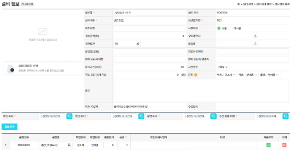 |
| BOM / 완제품·반제품 관리 화면 |  |
| 생산관리 화면 (키오스크) |   |
| 작업일보 화면 | 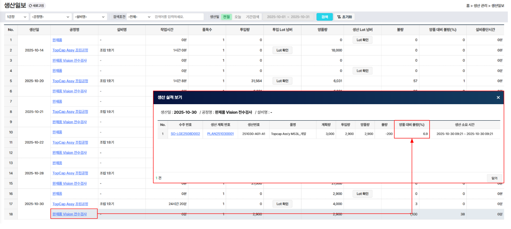 |

# 📱 My KT 앱 - SHOP 메뉴 개발

> My KT 앱 내 SHOP 메뉴를 개발하여, 무선/유선/액세서리 상품의 조회부터 결제까지 이어지는 전체 구매 프로세스를 구축한 프로젝트입니다. 고객용 SHOP과 별도의 운영자(관리자) 프로젝트를 함께 개발하고, 본인인증·주소조회·결제·KOS Core 등 다수의 내·외부 시스템과 연동했습니다.

---

## 📋 목차
1. [프로젝트 개요](#-프로젝트-개요)
2. [기술 스택](#-기술-스택)
3. [시스템 구성도](#-시스템-구성도)
4. [주요 기능](#-주요-기능)
   - [1. SHOP 상품 조회 ~ 결제 프로세스](#1-shop-상품-조회--결제-프로세스)
   - [2. 운영자(Admin) 프로젝트 및 상품 노출 연동](#2-운영자admin-프로젝트-및-상품-노출-연동)
   - [3. 본인인증 연계 (PASS / 네이버 / SMS / 신용카드)](#3-본인인증-연계-pass--네이버--sms--신용카드)
   - [4. 행안부 주소 검색 API 연동](#4-행안부-주소-검색-api-연동)
   - [5. SmartroPAY 결제 연동](#5-smartropay-결제-연동)
   - [6. SHOP - KOS Core 연동](#6-shop---kos-core-연동)
5. [핵심 기술 포인트](#-핵심-기술-포인트)
6. [화면 구성](#-화면-구성)

---

## 📌 프로젝트 개요

| 항목 | 내용 |
|---|---|
| 프로젝트명 | My KT 앱 - SHOP 메뉴 개발 |
| 담당 역할 | 풀스택 개발 (SHOP/운영자 프로젝트 개발, 외부 시스템 연동) |
| 개발 기간 | 2023.10 ~ 2024.09  |
| 사용 기술 | Java, Spring Boot, postgresql |

My KT 앱 내 SHOP 메뉴는 무선/유선/액세서리 상품을 조회하고 결제까지 진행할 수 있는 커머스 영역입니다. 고객이 이용하는 SHOP과 상품/주문/업체를 관리하는 운영자 프로젝트를 분리 구조로 설계하여, 운영자가 등록한 상품이 고객용 홈페이지에 노출되도록 연동했습니다. 또한 본인인증, 주소조회, 결제, 사내 시스템(KOS Core) 등 다양한 외부/내부 시스템 연동을 통해 실제 커머스 프로세스를 구현했습니다.

---

## 🛠 기술 스택

- **Backend**: Java, Spring Boot
- **Frontend**: javascript
- **DB**: postgresql
- **외부 연동**: PASS / 네이버 / SMS / 신용카드 본인인증, 행정안전부 주소 검색 API, SmartroPAY, KOS Core

---

## 🏗 시스템 구성도

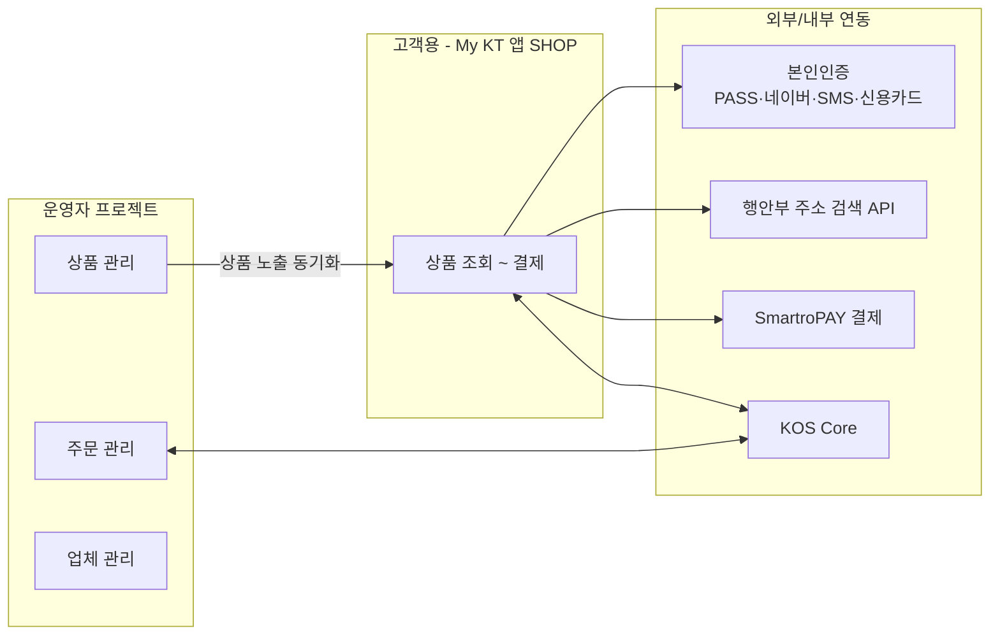

---

## 🎯 주요 기능

### 1. SHOP 상품 조회 ~ 결제 프로세스
- 무선, 유선, 액세서리 카테고리별 상품 목록 및 상세 조회 화면 개발
- 상품 선택 → 옵션/수량 설정 → 주문 → 결제로 이어지는 구매 프로세스 전체 개발
- 본인인증, 주소조회, 결제 연동 단계를 하나의 주문 플로우 안에서 순차적으로 연결

### 2. 운영자(Admin) 프로젝트 및 상품 노출 연동
- SHOP과는 별도의 운영자 프로젝트를 구축하여 상품/주문/업체(공급사) 정보를 관리
- 운영자 프로젝트에서 등록·수정한 상품 정보가 고객용 SHOP 홈페이지에 노출되도록 데이터 연동 구조 설계
- 운영자는 상품 노출 여부, 가격, 옵션 등을 관리하고, 변경 내용이 고객 화면에 즉시 반영되도록 구성

### 3. 본인인증 연계 (PASS / 네이버 / SMS / 신용카드)
- 4종의 본인인증 수단(PASS, 네이버, SMS, 신용카드)을 SHOP 주문 프로세스에 연동
- 각 인증사로부터 받은 **CI(연계정보)** 값을 기반으로 고객 정보를 조회하여 인증 여부를 확인
- 인증 결과에 따라 회원/비회원 주문 프로세스를 분기 처리

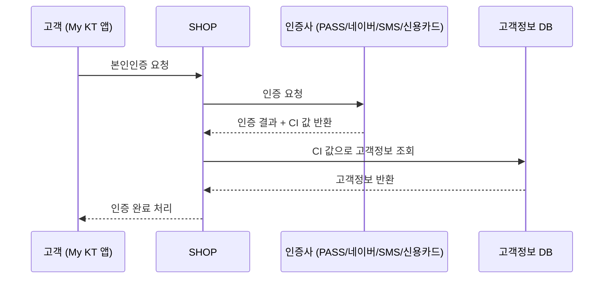

### 4. 행안부 주소 검색 API 연동
- 행정안전부 도로명주소 검색 API를 연동하여 배송지/설치 주소 검색 기능 구현
- 검색된 주소 데이터를 주문 정보에 매핑하여 저장

### 5. SmartroPAY 결제 연동
- 결제 진행 시 **token 값, 카드 정보, CI 정보**를 SmartroPAY에 전달하여 결제 요청
- SmartroPAY로부터 결제 결과(성공/실패 등)를 return 받아 주문 상태를 갱신하는 프로세스 개발

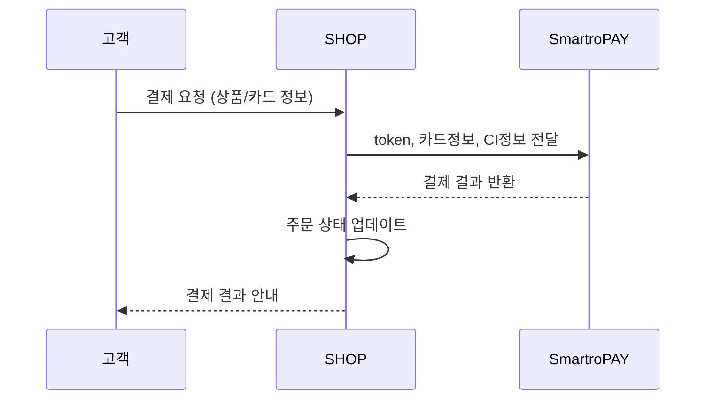

### 6. SHOP - KOS Core 연동
- SHOP과 KOS(Core) 시스템 간 연동 프로그램 개발
- 고객/상품/주문 등의 정보를 KOS Core와 동기화하여 SHOP에서 발생한 주문/계약 정보가 사내 코어 시스템에 반영되도록 구성

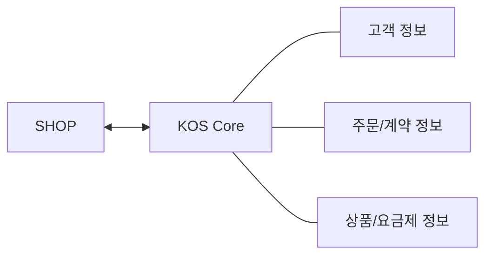

---

## 💡 핵심 기술 포인트

- **민감정보 처리 경험**: 본인인증 CI 값, 신용카드 정보, 결제 토큰 등 민감정보를 안전하게 전달·처리하는 결제/인증 연동 로직 구현
- **다중 외부 시스템 연동**: PASS, 네이버, SMS, 신용카드사, 행정안전부, SmartroPAY, KOS Core 등 다양한 외부/내부 시스템과의 연동 경험
- **고객-운영자 분리 구조 설계**: 고객용 SHOP과 운영자(Admin) 프로젝트를 분리하면서도 상품 데이터가 실시간으로 동기화되는 구조 설계
- **end-to-end 커머스 프로세스 구현**: 상품 조회 → 본인인증 → 주소조회 → 결제 → 주문 확정 → KOS Core 연동까지 전체 주문 흐름을 직접 설계 및 개발

---

## 🖼 화면 구성

> 보안상 소스코드는 비공개이며, 주요 화면 캡처로 대체합니다

| 화면 | 설명 |
|---|---|
| SHOP 상품 목록/상세 화면 | 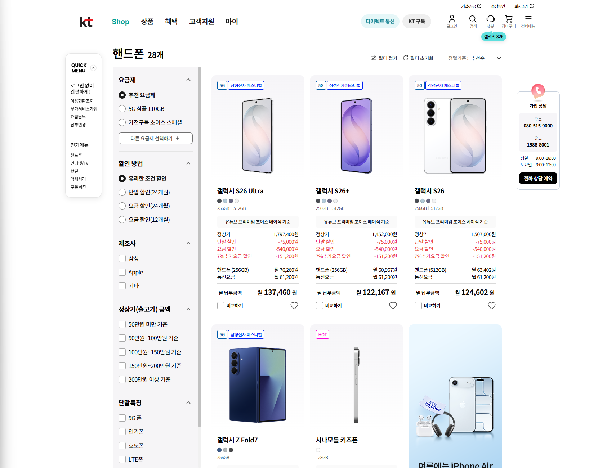 |
| 본인인증 화면 | 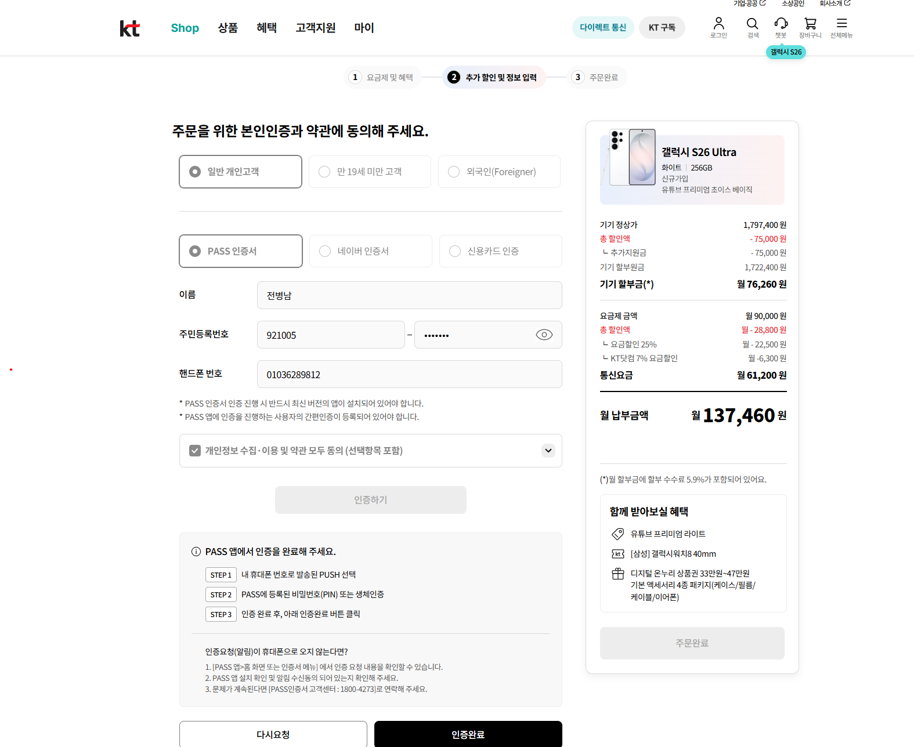 |
| 주소 검색 화면 | 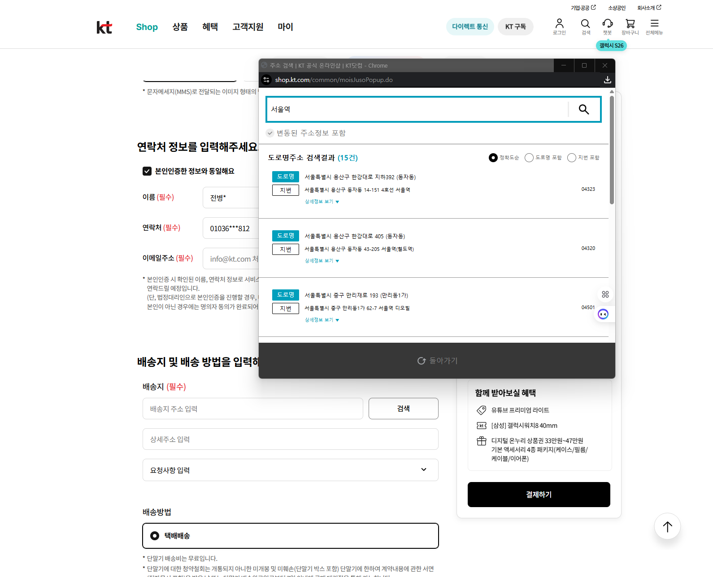 |
| 결제 화면 | 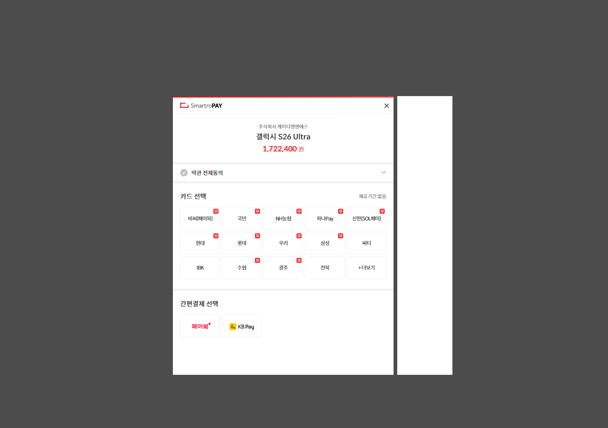 |

